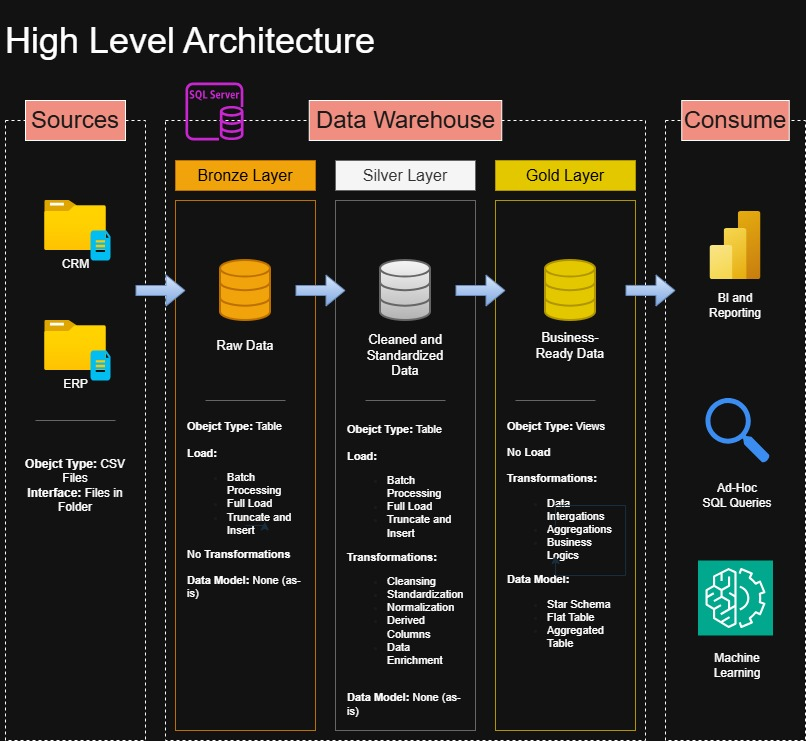

# 📊 Data Warehouse & Analytics Project  

This repository is based on and inspired by the original project:  
👉 https://github.com/DataWithBaraa/sql-data-warehouse-project

It demonstrates a comprehensive **Data Warehousing and Analytics solution**, from raw data ingestion to business-ready analytics.  
It is designed as a **portfolio project** showcasing best practices in **data engineering, data modeling, ETL pipelines, and SQL-based analytics**.

---

## 🚀 Project Overview

The goal of this project is to design and implement a **modern data warehouse** that consolidates sales data from multiple source systems and enables analytical reporting for business decision-making.

### Key Topics Covered
- Data Warehouse Architecture (Medallion Architecture)
- ETL Pipelines (Extract, Transform, Load)
- Data Modeling (Star Schema)
- SQL Analytics & Reporting
- Data Quality & Integration

---

## 🏗️ Data Architecture (Medallion Architecture)

The project follows the **Medallion Architecture** pattern with three layers:

### 🥉 Bronze Layer  
- Stores **raw data** as-is from source systems  
- Data ingested from **CSV files** into **SQL Server**

### 🥈 Silver Layer  
- Data **cleansing, standardization, and normalization**  
- Prepares clean and consistent data for analytics

### 🥇 Gold Layer  
- **Business-ready data models**  
- Fact and dimension tables in **star schema**  
- Optimized for reporting and analytical queries

---

## 🔄 ETL & Data Modeling

### ETL Pipelines
- Extract data from ERP and CRM source systems (CSV)
- Transform data (cleaning, formatting, normalization)
- Load structured data into the data warehouse

### Data Modeling
- Fact tables for sales and transactions  
- Dimension tables for customers, products, time, etc.  
- Optimized for BI and analytical workloads

---

## 📈 Analytics & Reporting

SQL-based analytical queries provide insights into:

- 👥 Customer Behavior  
- 📦 Product Performance  
- 📊 Sales Trends  

These insights enable **data-driven decision-making** for business stakeholders.

---

## 🧰 Tools & Technologies

- **Datasets:** CSV source files  
- **Database:** SQL Server Express  
- **Management:** SQL Server Management Studio (SSMS)  
- **Modeling & Diagrams:** Draw.io  
- **Project Management:** Notion  

---

## 🎯 Project Requirements

### Data Engineering – Data Warehouse

**Objective:**  
Develop a modern data warehouse in SQL Server for consolidated analytical reporting.

**Specifications:**
- Source systems: ERP & CRM (CSV files)  
- Data quality: cleansing & validation before analysis  
- Integration: unified analytical data model  
- Scope: latest dataset only (no historization)  
- Documentation: clear data model documentation for business & analytics teams  

---

### BI & Analytics

**Objective:**  
Create SQL-based analytics to provide insights into:

- Customer behavior  
- Product performance  
- Sales trends  

These outputs support strategic and operational business decisions.

---

## 🧑‍💻 Author - Tamás Csiba

Created as a **portfolio project** to demonstrate practical skills in data engineering and analytics.

---

